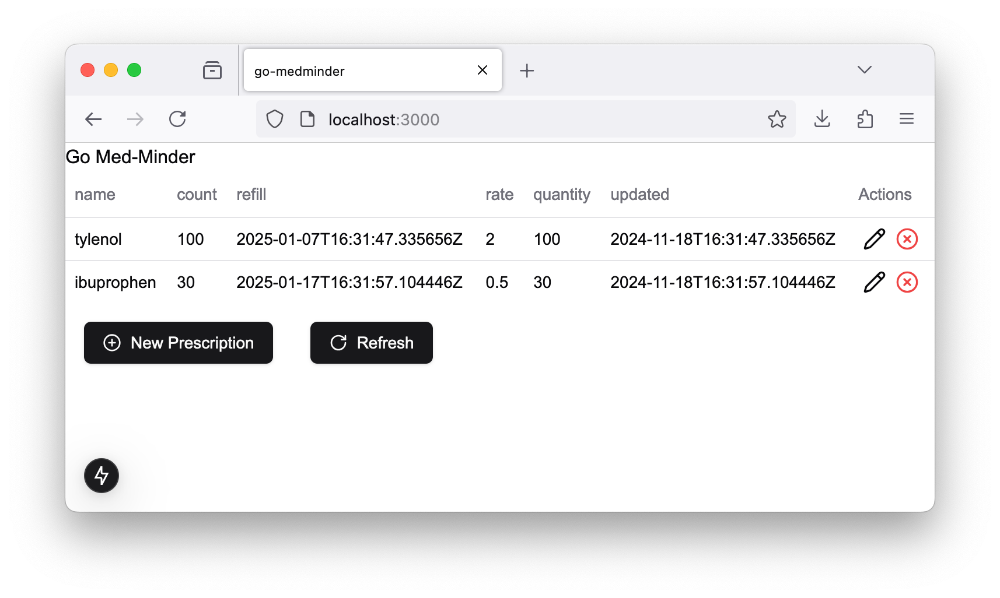

# go-medminder

This repository contains a simple utility for managing and tracking prescription medications. It is
a work in progress, started primarily to learn the Go programming language.

Presently a simple CLI and Web UI are implemented to manipulate prescription information. The web UI
operates over an HTTP REST API, so interactions with the service can be automated as well.

## Usage

### API

It is recommended to run the API server using a container. The `Dockerfile` in this repository
contains the build instructions for the image. By default the API server binds port `8080`. The
following routes are implemented:

- `GET` `/rx` -- Lists all known prescription names. Returns an array of strings.
- `GET` `/rx/:name` -- Gets detailed information about a particular prescription.
- `POST` `/rx/:name` -- Creates a new prescription with the given name.
  Body must look something like: `{"quantity": 123.45, "rate": 56.789 }`
- `PATCH` `/rx/:name` -- Updates the information of the prescription with the given name.
  Body must look something like: `{"quantity": 123.45, "rate": 56.789 }`
  Where any combination of `quantity` and/or `rate` can be provided.
- `DELETE` `/rx/:name` -- Deletes the prescription with the given name.

In the container, the default location for the sqlite3 database is
`/home/rxm/.config/go-medminder/db.sqlite3`. You can use a volume to expose this file or directory
to the host filesystem.

### Web UI

With the backend running, change directory to the `frontend` directory, and run `npm run dev` to run
the development server. Running `npm run build` will build the site.

### CLI

Build using `go build ./cmd/rxm`. Install using `go install ./cmd/rxm`.

The CLI program is called `rxm` (short for Prescription Manager). There are several subcommands:

- `rxm add [name] [quantity] [rate]` -- Adds a new prescription named `name` with `quantity` amount
  of the medication, where `rate` amount of medication is used per day.
- `rxm rm [name]` -- Remove the prescription named `name`. Permanently loses information.
- `rxm up [name] quantity [quantity]` -- Update the current `quantity` for the prescription named
  `name`.
- `rxm up [name] rate [rate]` -- Update the current `rate` for the prescription named `name`.
- `rxm ls` -- List basic information about all prescriptions in the database.
- `rxm ls [name]` -- List detailed information about the prescription named `name`.

On Linux, by default, the database file will be placed at `$XDG_CONFIG_DIR/go-medminder/db.sqlite3`,
or if `XDG_CONFIG_DIR` is not set, then `~/.config/go-medminder/db.sqlite3` is the default. On
Windows `$APPDATA/go-medminder/db.sqlite3` is the location. A flag can be added to the `rxm`
invocation to override this default location: `-db [path]` where `path` is the absolute or relative
path to the desired location of the database file. If the database file does not already exist, it
is created upon invocation of `rxm`.